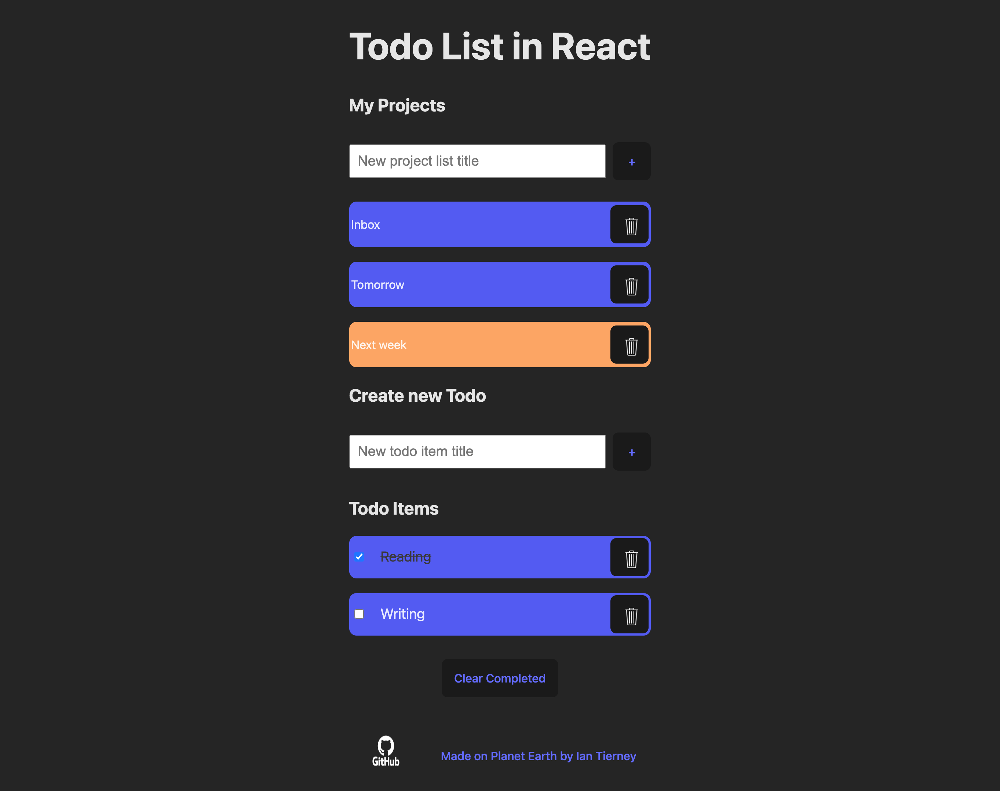

# React Todo List

Attempted a todo list using React. 
It has the ability to have seperate lists of todo items. 
Each todo item can be checked and unchecked. 
The checked items can all be cleared from the list using the clear completed button.
Individual lists and todo items can be removed using the delete button (trash can icon).
Upon page refresh, the lists and todo items are still there due to local storage in browser. 
The default list of inbox cannot be deleted. All new todos default to inbox unless another list is actively selected. 

## Desktop view
